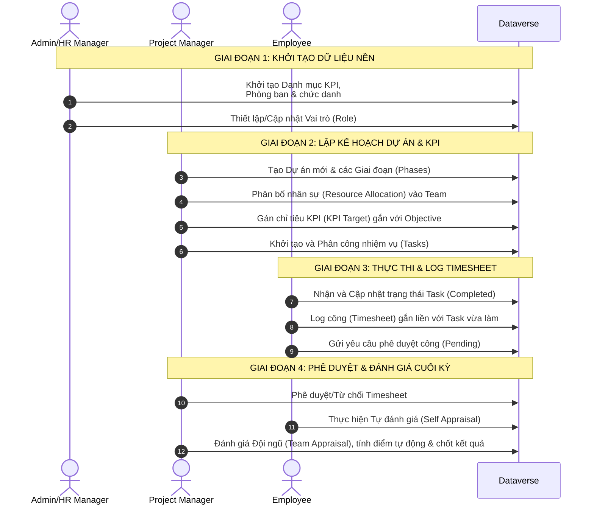

# 📝 KỊCH BẢN KIỂM THỬ TOÀN DIỆN (COMPREHENSIVE MULTI-ROLE TEST PLAN)
## Hệ Thống Quản Lý Dự Án & Chỉ Số Hiệu Suất (Task & KPI Management System)

Tài liệu này cung cấp kịch bản kiểm thử tích hợp (End-to-End Integration Testing) theo chu kỳ nghiệp vụ thực tế của doanh nghiệp. Kịch bản mô phỏng luồng tương tác đa vai trò giữa **Super Admin / HR Manager**, **Project Manager** (Quản lý dự án), và **Employee** (Nhân viên) trên cơ sở dữ liệu Dataverse trực tuyến.

---

## 🗺️ Sơ đồ tương tác luồng nghiệp vụ (Sequence Diagram)

---

## 👥 Các Vai Trò Tham Gia Kiểm Thử (Roles & Permissions)

1. **Super Admin / HR Manager**:
   * Quyền cấu hình toàn hệ thống.
   * Quản lý Danh bạ (Directory), đổi quyền người dùng (Role Switcher).
   * Tạo danh mục KPI nền (KPI Library), Cơ cấu Công ty, Phòng ban, Chức danh.
2. **Project Manager (PM)**:
   * Quyền quản trị dự án, thiết lập đội ngũ và gán chỉ tiêu.
   * Tạo Dự án, chia Giai đoạn (Phases), lập đội nhóm (Resource Allocations).
   * Gán mục tiêu KPI cho nhân sự cấp dưới; Giao việc và tạo nhiệm vụ.
   * Phê duyệt chấm công (Timesheet approvals) và chấm điểm hiệu suất cuối kỳ (Team Appraisals).
3. **Employee (Nhân viên)**:
   * Quyền thực thi cá nhân.
   * Xem nhiệm vụ được giao, cập nhật tiến độ công việc.
   * Log giờ làm việc gắn với nhiệm vụ; gửi yêu cầu phê duyệt công.
   * Xem KPIs cá nhân; Tự đánh giá hiệu suất cuối kỳ (Self Appraisals).

---

## 🛠️ Chi Tiết Các Bước Thực Hiện Chạy Thử (Step-by-Step Test Execution)

### Giai đoạn 1: Khởi tạo cấu trúc & Phân quyền (Thực hiện bởi Admin/HR)
Mục tiêu: Đảm bảo dữ liệu danh mục cốt lõi sẵn sàng để PM lập kế hoạch.

| Bước | Thao tác (Action) | Giao diện thực hiện | Kết quả mong đợi (Expected Result) | Trạng thái |
|:---:|:---|:---|:---|:---:|
| **1.1** | Đăng nhập tài khoản Admin/HR. Kiểm tra phân quyền ban đầu. | Menu trái -> **Directory** | Hệ thống nhận diện đúng vai trò **Super Admin** trên badge cá nhân phía trên góc trái. | `[ ]` |
| **1.2** | Truy cập **Danh mục KPI** (KPI Library) và thêm một chỉ số mẫu. | Menu trái -> **Danh mục KPI** -> Bấm `+ Tạo Template` | Form hiện ra. Điền các trường: - Tên KPI: *Tỷ lệ hoàn thành Task đúng hạn* - Đơn vị đo: *%* - Loại chỉ số: *Quality* Nhấn **Lưu**. Bản ghi hiển thị ngay trên lưới danh sách. | `[ ]` |
| **1.3** | Tạo một **Objective** (Mục tiêu chiến lược tổng thể) cho chu kỳ hiện tại. | Menu trái -> **Dashboard** -> Mục *Strategic Objectives* -> Bấm `+ Add Objective` | Điền tên: *Đạt chất lượng phần mềm QLDA Q2/2026*. Chọn trọng số, ngày bắt đầu và kết thúc chu kỳ. Nhấn **Lưu**. | `[ ]` |
| **1.4** | Kiểm tra danh sách nhân viên và đảm bảo nhân sự kiểm thử đã có tài khoản. | Menu trái -> **Directory** | Danh sách hiển thị đầy đủ thông tin nhân sự. Xác nhận tài khoản Email của nhân viên thử nghiệm đang có trạng thái `Active`. | `[ ]` |

---

### Giai đoạn 2: Lập Kế Hoạch Dự Án & KPI (Thực hiện bởi Project Manager)
Mục tiêu: Lập dự án, phân công nhân sự và giao chỉ tiêu KPI chi tiết cho nhân viên.

> [!NOTE]
> *Để thực hiện giai đoạn này, bạn cần truy cập **[make.powerapps.com](https://make.powerapps.com/)** > Tables > User và cập nhật cột `new_status` hoặc `cr5db_systemrole` của bạn thành `ProjectManager` (hoặc dùng tài khoản có vai trò PM).*

| Bước | Thao tác (Action) | Giao diện thực hiện | Kết quả mong đợi (Expected Result) | Trạng thái |
|:---:|:---|:---|:---|:---:|
| **2.1** | Tạo một dự án mới làm môi trường kiểm thử. | Menu -> **Resources** -> Tab **Projects List** -> Bấm `+ Thêm dự án` | Form tạo dự án hiện ra. Nhập: - Tên dự án: *Traffic Analysis Engine* - Mô tả: *Phần mềm phân tích mật độ giao thông* - Trạng thái: *In Progress* Nhấp **Lưu**. Dự án được tạo thành công và xuất hiện trên lưới danh sách. | `[ ]` |
| **2.2** | Thiết lập các giai đoạn (Phases) của dự án. | Chọn dự án vừa tạo -> Tại panel chi tiết bên phải -> Khu vực **Phases** -> Bấm `+ Add Phase` | Form hiện ra. Nhập: - Tên giai đoạn: *Phase 1: Database Setup & Integration* - Trạng thái: *In Progress* Nhấp **Lưu**. Giai đoạn mới hiển thị đúng trạng thái *In Progress* (màu xanh dương). | `[ ]` |
| **2.3** | Phân bổ nhân sự vào dự án để nhân viên có thể chọn dự án khi làm việc. | Menu -> **Resources** -> Tab **Project Allocations** -> Bấm `+ Phân bổ nhân sự` | Chọn: - Nhân sự: Chọn tài khoản Nhân viên kiểm thử. - Dự án (Team): Chọn *Traffic Analysis Engine*. - Tỷ lệ phân bổ: *100%*. Nhấp **Lưu**. Bản ghi phân bổ xuất hiện trong bảng. | `[ ]` |
| **2.4** | Giao chỉ tiêu KPI cá nhân cho nhân viên gắn liền với mục tiêu chiến lược. | Menu -> **My KPIs** -> Bấm `+ Gán KPI mới` | Form hiện ra. Điền: - Nhân viên: Chọn Nhân viên kiểm thử. - Chỉ số mẫu: Chọn *Tỷ lệ hoàn thành Task đúng hạn*. - Mục tiêu cụ thể: *Đảm bảo 95% Task đúng hạn*. - Chỉ tiêu số (Target): *95*. - Mục tiêu chung: Chọn *Đạt chất lượng phần mềm QLDA Q2/2026*. Nhấp **Gán chỉ tiêu**. | `[ ]` |
| **2.5** | Tạo nhiệm vụ và giao cho nhân viên thực hiện. | Menu -> **My Tasks** -> Bấm `+ New Task` | Điền thông tin: - Tên công việc: *Thiết lập Schema Dataverse cho bảng ProjectRisk* - Mô tả: *Định nghĩa các cột và khóa ngoại liên kết* - Giao cho: Chọn Nhân viên kiểm thử. - Giai đoạn dự án: Chọn *Phase 1: Database Setup & Integration*. - Mục tiêu liên kết: Chọn *Đạt chất lượng phần mềm QLDA Q2/2026*. Nhấp **Tạo nhiệm vụ**. | `[ ]` |

---

### Giai đoạn 3: Thực Thi & Báo Cáo Công (Thực hiện bởi Employee)
Mục tiêu: Nhân viên nhận việc, hoàn thành công việc, báo cáo giờ làm việc (Timesheet).

> [!NOTE]
> *Chuyển đổi vai trò người dùng trong cơ sở dữ liệu sang `Employee` để thực hiện kiểm thử.*

| Bước | Thao tác (Action) | Giao diện thực hiện | Kết quả mong đợi (Expected Result) | Trạng thái |
|:---:|:---|:---|:---|:---:|
| **3.1** | Kiểm tra danh sách công việc được giao trên Dashboard và trang Task. | Menu -> **Dashboard** & **My Tasks** | Dashboard hiển thị *Tasks Due Today* hoặc *Upcoming Tasks* tăng lên **1**. Trang *My Tasks* xuất hiện thẻ nhiệm vụ *Thiết lập Schema Dataverse...* trạng thái **In Progress**. | `[ ]` |
| **3.2** | Cập nhật hoàn thành công việc sau khi hoàn tất. | Menu -> **My Tasks** -> Tìm thẻ công việc -> Bấm nút **Hoàn tất** | Thẻ công việc chuyển sang màu xanh lá với nhãn **Completed**. Nút hoàn tất biến mất để tránh bấm nhầm. | `[ ]` |
| **3.3** | Báo cáo giờ làm việc thực tế cho nhiệm vụ đã hoàn thành. | Menu -> **Timesheets** -> Bấm `Log Time ->` | Form log giờ hiện ra: - Số giờ thực tế: *8.0* - Ngày log: Ngày hôm nay. - Chọn nhiệm vụ: Chọn *Thiết lập Schema Dataverse...* - Nhập mô tả công việc. Nhấp **Log Time**. Bản ghi mới xuất hiện trong danh sách với nhãn trạng thái màu cam **Pending**. | `[ ]` |
| **3.4** | Kiểm tra biểu đồ KPIs cá nhân để theo dõi chỉ số. | Menu -> **My KPIs** -> Tab **Progress Charts** | Biểu đồ cập nhật điểm số thực tế dựa trên các task đã hoàn thành (nếu hệ thống đã được đồng bộ điểm). | `[ ]` |

---

### Giai đoạn 4: Phê Duyệt & Chấm Điểm Hiệu Suất (PM / Admin thực hiện)
Mục tiêu: Quản lý xem xét chất lượng công việc, duyệt timesheet và chấm điểm đánh giá cuối kỳ.

> [!NOTE]
> *Chuyển đổi vai trò người dùng trong cơ sở dữ liệu sang `ProjectManager` hoặc `Admin` để thực hiện.*

| Bước | Thao tác (Action) | Giao diện thực hiện | Kết quả mong đợi (Expected Result) | Trạng thái |
|:---:|:---|:---|:---|:---:|
| **4.1** | Truy cập danh sách yêu cầu chờ duyệt để phê duyệt công cho nhân viên. | Menu -> **Requests** (hoặc tab phê duyệt của PM) | Danh sách hiện yêu cầu Timesheet **8.0 giờ** của nhân viên ở bước 3.3. Hiển thị chi tiết mô tả công việc và nút tác vụ phê duyệt. | `[ ]` |
| **4.2** | Phê duyệt chấm công. | Click nút **Approve** (Đồng ý) trên bản ghi yêu cầu Timesheet | Trạng thái bản ghi chuyển sang màu xanh lá **Approved**. Ô *Total Approved Hours* trên Dashboard tăng tương ứng. | `[ ]` |
| **4.3** | *(Tùy chọn)* Kiểm thử nhánh Từ chối công. | Tạo 1 bản log công nháp -> Chọn bản ghi đó -> Bấm **Reject** (Từ chối) | Bản ghi hiển thị trạng thái màu đỏ **Từ chối**. Yêu cầu nhân viên phải chỉnh sửa hoặc gửi lại. | `[ ]` |
| **4.4** | Bắt đầu quy trình đánh giá hiệu suất cuối kỳ (Performance Appraisal). | Menu -> **Performance** -> Tab **Team Appraisals** | Bảng hiển thị danh sách đợt đánh giá của nhân viên cấp dưới. Cột nhân viên hiển thị đúng tên người dùng (đã sửa lỗi Bind Data). | `[ ]` |
| **4.5** | Thực hiện tính toán điểm tự động dựa trên kết quả thực tế. | Chọn đợt đánh giá của nhân viên kiểm thử -> Bấm nút **Tự tính** | Hệ thống tự động tính toán dựa trên tiến độ hoàn thành KPI mục tiêu và điền số điểm chung cuộc chính xác vào ô nhập liệu (Đã sửa lỗi ghi đè số 0). | `[ ]` |
| **4.6** | Chốt kết quả đánh giá cuối cùng và lưu vào cơ sở dữ liệu. | Nhập nhận xét đánh giá -> Bấm **Lưu đánh giá** | Bản ghi đánh giá được cập nhật thành công lên Dataverse và chuyển sang trạng thái hoàn thành đánh giá. | `[ ]` |

---

## 🎯 Tiêu Chỉ Nghiệm Thu (Success Criteria)

Hệ thống được coi là vượt qua kỳ kiểm thử tích hợp (Integration Test Passed) khi và chỉ khi:
- [ ] Không xảy ra lỗi **Silent Failure**: Mọi thao tác lưu dữ liệu (Tạo Dự án, Tạo Phase, Tạo Risk, Gán KPI, Tạo Task, Log công) đều đóng form và cập nhật tức thì dữ liệu lên giao diện lưới mà không cần F5 thủ công.
- [ ] Logic trạng thái của Project Phase hoạt động hoàn hảo: Khi chọn trạng thái *In Progress* hoặc *Completed* lúc tạo Phase, nhãn hiển thị tương ứng chính xác trên panel chi tiết của dự án (sử dụng cột `new_status` của Dataverse).
- [ ] Sự tương tác giữa các vai trò diễn ra thông suốt: Dữ liệu do nhân viên tạo (Task hoàn thành, Timesheet gửi đi) hiển thị chính xác trên giao diện phê duyệt của PM và ngược lại.
- [ ] Giao diện đáp ứng thẩm mỹ hiện đại, không còn bất kỳ Developer Tools hay Role Switcher nào lộ trên màn hình client.

---
*Tài liệu được soạn thảo và kiểm duyệt bởi QA team của dự án.*
