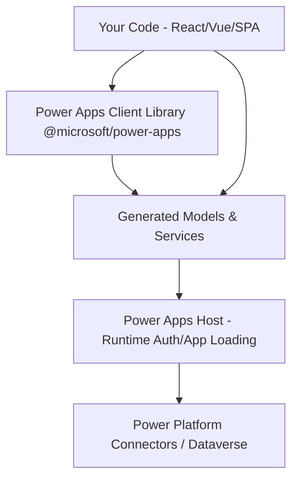

# Nghiên cứu và Tổng hợp: Power Apps Code Apps (Code-First Web Apps)

Tài liệu này tổng hợp toàn bộ kết quả nghiên cứu từ các liên kết chính thức trong tài liệu của Microsoft về **Power Apps Code Apps** (ứng dụng code-first). Đây là một công nghệ cho phép các nhà phát triển xây dựng và triển khai các ứng dụng web tùy biến sử dụng các IDE truyền thống (như VS Code) và các framework hiện đại (React, Vue, v.v.), nhưng chạy và được quản lý trực tiếp trên nền tảng **Power Platform**.

---

## 1. Tổng quan về Power Apps Code Apps

**Power Apps Code Apps** cho phép các nhà phát triển chuyên nghiệp (Pro-developers) kết hợp khả năng phát triển ứng dụng web code-first với sức mạnh quản trị và tích hợp của Power Platform.

### Các tính năng cốt lõi:
- **Xác thực & Phân quyền**: Tích hợp sẵn cơ chế đăng nhập và phân quyền bằng **Microsoft Entra ID**.
- **Tích hợp dữ liệu**: Gọi trực tiếp các nguồn dữ liệu của Power Platform và hơn 1.500+ connectors (bao gồm cả Dataverse, SQL, SharePoint, v.v.) trực tiếp từ JavaScript/TypeScript.
- **Lưu trữ & Triển khai nhanh**: Lưu trữ và xuất bản dễ dàng các ứng dụng doanh nghiệp (Line-of-Business - LOB) lên Power Platform.
- **Tuân thủ chính sách**: Các ứng dụng tuân thủ đầy đủ các chính sách của Managed Platform (giới hạn chia sẻ ứng dụng, Conditional Access, DLP - Data Loss Prevention, v.v.).
- **Quản lý vòng đời ứng dụng (ALM)**: Đơn giản hóa quy trình tích hợp và triển khai liên tục (CI/CD) thông qua các giải pháp (Solutions) của Power Platform.

---

## 2. Kiến trúc hệ thống (Architecture)

Kiến trúc của Code Apps bao gồm hai giai đoạn chính: **Phát triển (App Development)** và **Chạy ứng dụng (Runtime)**.

### Các thành phần chính:
1. **`power.config.json`**: File cấu hình chứa metadata được tạo tự động bởi client library. Nó được CLI và thư viện client sử dụng để cấu hình các kết nối và xuất bản app.
2. **Power Apps Client Library (`@microsoft/power-apps`)**: Thư viện npm cung cấp các API để code của bạn tương tác với Power Platform Host và tự động tạo các TypeScript Model/Service khi kết nối dữ liệu.
3. **Power Platform CLI / npm-based CLI**: Công cụ dòng lệnh hỗ trợ khởi tạo, phát triển cục bộ và đẩy ứng dụng (`push`) lên môi trường Power Platform.
4. **Power Apps Host**: Thành phần chạy ở runtime để quản lý xác thực của người dùng cuối, tải ứng dụng và hiển thị các thông báo lỗi nếu có.



---

## 3. Điều kiện tiên quyết & Chuẩn bị (Prerequisites)

### Yêu cầu đối với Maker (Developer):
- **IDE**: Visual Studio Code hoặc các IDE tùy chọn khác.
- **Node.js**: Phiên bản LTS.
- **Git**: Phiên bản mới nhất.
- **CLI**: Sử dụng CLI dựa trên npm đi kèm với gói `@microsoft/power-apps` (khuyên dùng từ phiên bản 1.0.4) thay thế cho lệnh `pac code` cũ.

### Yêu cầu cấu hình hệ thống (Admin):
1. Đăng nhập vào [Power Platform Admin Center](https://admin.powerplatform.microsoft.com).
2. Vào **Manage** > **Environments** > Chọn môi trường của bạn.
3. Vào **Settings** > Mở rộng **Product** > Chọn **Features**.
4. Tìm tính năng **Power Apps code apps** và bật nút **Enable code apps**.
5. Nhấn **Save**.

### Yêu cầu về Bản quyền:
- Người dùng cuối khi chạy Code Apps bắt buộc phải có giấy phép **Power Apps Premium**.

---

## 4. Các bước khởi tạo ứng dụng (Quickstart)

Từ phiên bản client library `1.0.4`, Microsoft cung cấp một CLI gọn nhẹ dựa trên npm giúp giảm bớt các công cụ phụ thuộc so với việc dùng PAC CLI.

### Bước 1: Khởi tạo dự án bằng Vite Template
Sử dụng công cụ `degit` để tải nhanh mã nguồn mẫu của Microsoft:
```bash
npx degit github:microsoft/PowerAppsCodeApps/templates/vite my-app
cd my-app
```

### Bước 2: Cài đặt thư viện & Khởi tạo Code App
Cài đặt các dependency cần thiết:
```bash
npm install
```
Sau đó khởi tạo dự án Code App. Bạn có thể sử dụng chế độ tương tác (Interactive mode) hoặc truyền trực tiếp tham số:
```bash
# Chế độ tương tác
npx power-apps init

# Hoặc chế độ truyền tham số trực tiếp
npx power-apps init --display-name "My First Code App" --environment-id <Your-Environment-ID>
```
*Lưu ý: CLI sẽ tự động nhắc bạn đăng nhập bằng tài khoản Power Platform để xác thực.*

### Bước 3: Chạy ứng dụng dưới Local
```bash
npm run dev
```
Lệnh này sẽ khởi động local development server. Bạn sẽ mở liên kết có tên là **Local Play** trong trình duyệt của mình.

> [!IMPORTANT]
> **Hạn chế truy cập mạng nội bộ (Local Network Access Restrictions):**
> Từ tháng 12/2025, Chrome và Edge mặc định chặn các yêu cầu từ trang web public đến local endpoints (localhost). Do đó:
> - Cần chạy ứng dụng trong cùng một profile trình duyệt đã đăng nhập tài khoản Power Platform.
> - Đối với kịch bản nhúng iframe, thẻ iframe phải chứa thuộc tính `allow="local-network-access"`.
> - Có thể cần cấu hình policy của trình duyệt để cấp quyền kết nối localhost.

### Bước 4: Đóng gói và Triển khai lên Cloud
Khi ứng dụng đã sẵn sàng, thực hiện build và đẩy app lên môi trường:
```bash
npm run build
npx power-apps push
```
Khi hoàn thành thành công, CLI sẽ trả về một đường link URL Power Apps để bạn chạy ứng dụng chính thức.

---

## 5. Kết nối Dữ liệu (Connect to Data)

Code Apps hỗ trợ cả nguồn dữ liệu dạng phi bảng (Nontabular) và dạng bảng (Tabular).

### Quy trình kết nối:
1. **Tạo Connection trên Power Apps Portal**:
   - Truy cập [Power Apps Maker Portal](https://make.powerapps.com).
   - Chọn mục **Connections** > **New Connection** > Chọn connector mong muốn (ví dụ: Office 365 Users, SQL, SharePoint, v.v.).
2. **Lấy API Name và Connection ID**:
   - Bạn có thể lấy thông tin này bằng lệnh CLI:
     ```powershell
     pac connection list
     ```
   - Hoặc lấy trực tiếp từ URL của Browser khi xem chi tiết Connection trong Maker Portal.
3. **Thêm kết nối vào Code App**:
   - **Đối với dữ liệu phi bảng (Nontabular - ví dụ: Office 365 Users)**:
     ```powershell
     pac code add-data-source -a "shared_office365users" -c "<connectionId>"
     ```
   - **Đối với dữ liệu dạng bảng (Tabular - ví dụ: SQL, SharePoint)**:
     Cần cung cấp thêm Table ID (`-t`) và Dataset Name (`-d`):
     ```powershell
     # Ví dụ SQL Server
     pac code add-data-source -a "shared_sql" -c "<connectionId>" -t "[dbo].[MobileDeviceInventory]" -d "server.database.windows.net,database_name"
     
     # Ví dụ SharePoint (t là tên danh sách, d là URL site)
     pac code add-data-source -a "shared_sharepointonline" -c "<connectionId>" -t "TravelRequest" -d "https://contoso.sharepoint.com/sites/TravelPolicies"
     ```
   - **Khám phá cấu trúc dữ liệu qua CLI**:
     ```powershell
     # Xem danh sách datasets
     pac code list-datasets -a <apiId> -c <connectionId>
     # Xem các bảng trong dataset
     pac code list-tables -a <apiId> -c <connectionId> -d <datasetName>
     # Xem stored procedures của SQL
     pac code list-sql-stored-procedures -c <connectionId> -d <datasetName>
     ```

> [!TIP]
> **Sử dụng Connection References (Khuyên dùng cho ALM)**:
> Từ tháng 12/2025 (phiên bản CLI 1.51.1+), bạn có thể liên kết ứng dụng với **Connection References** thay vì gán cứng Connection ID cá nhân. Điều này giúp giải pháp trở nên linh hoạt khi chuyển đổi giữa các môi trường Dev, Test, Prod:
> ```shell
> pac code add-data-source -a <apiName> -cr <connectionReferenceLogicalName> -s <solutionID>
> ```

4. **Sử dụng các Service & Model được tự động tạo**:
   Khi bạn thêm một data source, CLI tự động tạo mã TypeScript tương ứng đặt tại thư mục `/generated/services/` và `/generated/models/`.
   
   *Ví dụ gọi hàm trong code:*
   ```typescript
   import { Office365UsersService } from './generated/services/Office365UsersService';
   
   // Lấy profile người dùng
   const profile = (await Office365UsersService.MyProfile_V2()).data;
   ```

---

## 6. Biến môi trường (Environment Variables)

Để tránh việc gán cứng (hardcode) các giá trị Dataset và Table khi di chuyển app qua các môi trường, bạn có thể tham chiếu các **Environment Variables** có sẵn trong Power Platform Solution của bạn.

Cú pháp sử dụng là tiền tố `@envvar:` đi kèm với schema name của biến:
```powershell
pac code add-data-source --apiid shared_sharepointonline --connectionId <your_connection_id> --dataset "@envvar:crd1b_SharepointSiteVar" --table "@envvar:crd1b_sharepointList"
```
Thông tin này sẽ được lưu vào file `power.config.json` và tự động phân giải giá trị thực tế tại runtime tùy thuộc vào môi trường ứng dụng đang chạy.

---

## 7. Lấy dữ liệu ngữ cảnh (Retrieve Context Data)

Bạn có thể lấy thông tin chi tiết về ứng dụng, người dùng hiện tại và session hiện tại bằng cách gọi hàm `getContext` của SDK:

```typescript
import { getContext } from '@microsoft/power-apps/app'; 

const ctx = await getContext();

// Truy cập thông tin ngữ cảnh
const appId = ctx.app.appId;
const environmentId = ctx.app.environmentId;
const queryParams = ctx.app.queryParams; // Các query parameter từ URL
const fullName = ctx.user.fullName;
const userPrincipalName = ctx.user.userPrincipalName; // UPN/Email
const sessionId = ctx.host.sessionId; // ID của session phục vụ telemetry/debugging
```

---

## 8. Các giới hạn hiện tại của Code Apps (Limitations)

Tính đến các tài liệu cập nhật mới nhất, công nghệ Code Apps vẫn có một số giới hạn cần lưu ý:
- Chưa hỗ trợ **Storage Shared Access Signature (SAS) IP restriction**.
- Chưa tích hợp trực tiếp với cơ chế **Power Platform Git integration** (tuy nhiên do code là code-first, bạn có thể tự quản lý source code bằng Git riêng của mình).
- Không chạy được trên app **Power Apps mobile** hoặc **Power Apps for Windows** (chỉ chạy trên môi trường trình duyệt web).
- Chưa hỗ trợ trực tiếp hàm tích hợp Power BI (`PowerBIIntegration`), nhưng có thể được nhúng vào các báo cáo Power BI thông qua *Power Apps Visual*.
- Không hỗ trợ tùy biến các biểu mẫu mặc định của SharePoint (**SharePoint forms integration**).
- **Service Principals (SPN)** hiện tại chưa thể tạo hoặc làm chủ sở hữu (owner) của Code Apps.
